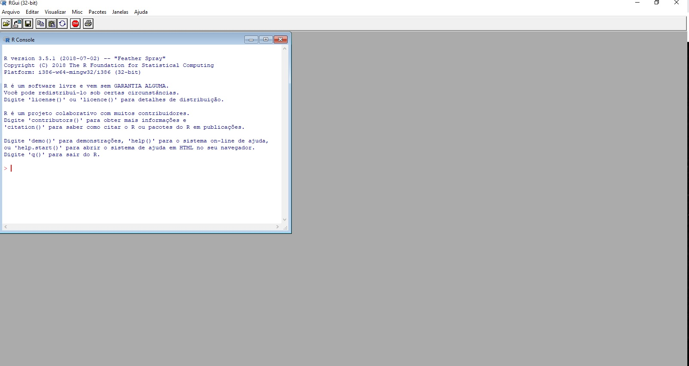

```{r setup, include=FALSE}
library(learnr)
knitr::opts_chunk$set(echo = T, warning = F, fig.align = "center", message = F,
                      error = F)
```


# Introdução à Linguagem R

## Introdução


<p style="text-align: justify;">
A linguagem R é uma linguagem de programação e um ambiente de software projetado para computação estatística e gráficos. Foi criada por Ross Ihaka e Robert Gentleman na década de 1990. Sua importância reside na sua ampla utilização em estatística, ciência de dados e análise de dados, especialmente em ambientes acadêmicos e de pesquisa. Sua comunidade online é bastante ativa, com uma ampla gama de recursos, incluindo fóruns de discussão, pacotes de código aberto, tutoriais e documentação extensiva.
</p>
<p style="text-align: justify;">
Comparativamente às linguagens pagas, como SAS e SPSS, o R se destaca por ser de código aberto, o que significa que é gratuito para uso e modificação. Isso torna a entrada no campo da análise de dados mais acessível e permite uma comunidade de desenvolvedores mais diversificada e colaborativa. 
</p>
<p style="text-align: justify;">
O objetivo do projeto "Pesquisa e Criação de Ferramentas Práticas para o Ensino de Estatística" coordenado pelo professor Fernando de Souza Bastos e desenvolvido pela estudante do curso de Matemática da UFV, Darah Aparecida Pires Moreira, bolsista do programa PIBIC/CNPq 2023, é desenvolver recursos educacionais inovadores para aprimorar o ensino da disciplina de Estatística. Uma dessas ferramentas é a criação desta Apostila Interativa, que combina o uso do pacote learnR do Software R com o conteúdo da apostila referência da disciplina Estatística I (EST 106). Essa apostila interativa visa proporcionar aos alunos uma experiência de aprendizado mais dinâmica e participativa, permitindo que eles interajam com os conceitos estatísticos de forma prática e envolvente, utilizando as funcionalidades interativas do pacote learnR e também aprendendo um pouco de programação em Linguagem R. Vamos lhe apresentar os conceitos essenciais de Estatística Básica e programação em R.
</p>

```{r, out.width = "300px", fig.align='center', echo=FALSE}
knitr::include_graphics("images/beginWork.gif")
```

## Instalação do R e RStudio

<p style="text-align: justify;">
Caso deseje baixar o R em seu computador, sugerimos utilizar também o ambiente de desenvolvimento integrado RStudio, ambos podem ser baixados da seguinte forma: primeiro, acesse o site oficial do R (https://www.r-project.org/) e siga as instruções para baixar e instalar a versão compatível com o seu sistema operacional. Em seguida, acesse o site do RStudio (https://www.rstudio.com/) e vá até a seção de downloads, onde você poderá selecionar a versão adequada do RStudio para o seu sistema operacional e instalá-la seguindo as instruções fornecidas. Ambos os softwares são gratuitos e amplamente utilizados pela comunidade estatística e de ciência de dados.
</p>
<!--
```{r, echo=FALSE}
sliderInput("bins", "Number of bins:", 30, min = 1, max = 50)
plotOutput("distPlot")
```

```{r, context="server"}
output$distPlot = renderPlot({
  x = faithful[, 2]  # Old Faithful Geyser data
  bins = seq(min(x), max(x), length.out = input$bins + 1)
  hist(x, breaks = bins, col = 'darkgray', border = 'white')
})
```


#### RStudio

Apresente a tela inicial do RStudio


-->

### RStudio Cloud

<p style="text-align: justify;">
O RStudio Cloud é uma plataforma baseada na web que oferece um ambiente integrado para programação em R. Ele permite aos usuários acessar e executar projetos em R diretamente do navegador, eliminando a necessidade de instalação e configuração do software R e do ambiente RStudio em um computador local.
</p>
Para utilizar o RStudio Cloud, siga estes passos:

1 - Acesse o site do RStudio Cloud (https://rstudio.cloud/) e crie uma conta gratuita.

2 - Após criar uma conta e fazer login, você terá acesso ao seu dashboard, onde poderá criar novos projetos ou colaborar com projetos existentes.

3 - Para criar um novo projeto, clique em "New Project" e selecione a opção "New Project" novamente.

4 - Escolha um nome para o seu projeto e configure as opções conforme desejado.

5 - Após criar o projeto, você será direcionado para um ambiente RStudio completo, onde poderá escrever código em R, executar scripts, visualizar resultados e muito mais.

6 - Todos os arquivos associados ao projeto (scripts, dados, gráficos, etc.) são armazenados na nuvem e podem ser acessados a partir de qualquer dispositivo com conexão à internet.

<p style="text-align: justify;">
O RStudio Cloud é útil para aqueles que desejam aprender R, ensinar R em sala de aula, colaborar em projetos com outras pessoas ou simplesmente para quem precisa de acesso rápido a um ambiente R sem a necessidade de configurar um ambiente local. Além disso, ele oferece uma maneira conveniente de compartilhar análises e colaborar com colegas de equipe ou alunos, já que os projetos podem ser facilmente compartilhados via link.
</p>

## Preliminares

<p style="text-align: justify;">
O software R é um conjunto integrado de recursos para leitura e manipulação de dados, cálculos e exibição gráfica. O R é um programa baseado em linhas de comando. Isto é, o usuário cria uma linha de código através de uma sequência de palavras e números. Ao digitar a linha no console, o R interpreta e executa a ação codificada na linha. Também é possível informar para R, um conjunto de linhas de
uma única vez, que conhecemos como script. Ao processar o script no console, o R irá ler a primeira linha, interpretar e executar. Só depois que o processamento da primeira linha terminar, é que a segunda linha será lida, interpretada e executada. Esta sequência segue, até que todo o script tenha sido processado. 
</p>
<p style="text-align: justify;">
No caso do R, a linguagem utilizada recebe o mesmo nome: linguagem R. A linguagem R possui regras próprias, que chamamos de sintaxe. Estas regras precisam ser seguidas para assegurar que o programa interprete e processe as linhas com sucesso.
</p>
Após instalar o software R e abrir o programa veremos algo semelhante a:

```{r, out.width = "500px", fig.align='center', echo=FALSE}

```

<p style="text-align: justify;">
Apesar de ser simples utilizar o R diretamente do seu console raiz, existe um ambiente de desenvolvimento integrado (IDE) que é mais atrativo. O RStudio é o melhor ambiente disponível para programação em R. Ao abrir o RStudio, você verá 4 ambientes. Observe a figura abaixo.
</p>

```{r, out.width = "600px", fig.align='center', echo=FALSE}
knitr::include_graphics("images/rstudio-editor.png")
```

<p style="text-align: justify;">
Esses quadrantes representam o **editor**, o **console**, o **environment** e o **output**.  Eles vêm nesta ordem, e depois você pode organizá-los da forma que preferir.
</p>

Listamos abaixo as funções dos principais painéis:

- **Editor/Scripts**: é onde escrevemos nossos códigos.
- **Console**: é onde rodamos o código e recebemos as saídas. O R vive aqui!
- **Environment**: painel com todos os objetos criados na sessão.
- **Files**: mostra os arquivos no diretório de trabalho. É possível navegar entre diretórios.
- **Plots**: painel onde os gráficos serão apresentados.
- **Help**: janela onde a documentação das funções serão apresentadas.
- **History**: painel com um histórico dos comandos rodados.

Conhecer atalhos ajuda bastante quando estamos programando no RStudio. Veja os principais:

- **CTRL+ENTER**: roda a linha selecionada no script. Os atalhos mais utilizado.
- **ALT+-**: (<-) sinal de atribuição. Você usará o tempo todo.
- **CTRL+SHIFT+M**: (%>%) operador *pipe*. Guarde esse atalho, você usará bastante.
- **CTRL+1**: altera cursor para o script.
- **CTRL+2**: altera cursor para o console.
- **CTRL+ALT+I**: cria um chunk no R Markdown.
- **ALT+SHIFT+K**: janela com todos os atalhos disponíveis.

## 1.5 Conceitos Básicos
<!--
Introduzir conceitos como variáveis, tipos de dados (numéricos, caracteres, lógicos), operadores aritméticos e de comparação.
-->

<p style="text-align: justify;">
Na linguagem R, não é necessário declarar uma variável antes dela ser criada. O programa já tenta determinar a melhor classe com base na primeira vez que algo for atribuído à variável. Vamos compilar a seguinte linha: 
</p>

```{r one, exercise=TRUE}
x=1
```

O sinal "=" é a representação do termo atribuição, e pode ser substituído pelo sinal "<-". Portanto, o comando abaixo equivale ao comando anterior:

```{r two, exercise=TRUE}
x <- 1
```

<p style="text-align: justify;">
Os comandos acima são equivalentes e podem ser interpretados como: atribua o 
valor 1 à variável `x`. Ao criar a variável `x`, o R irá definir `x` como numérico e armazenar numa estrutura de vetor, pois o 1 é claramente um número. 

## Vetores e Matrizes 

<!--
Ensinar como criar, acessar e manipular vetores e matrizes.
-->

### Vetor

Vetor é a estrutura mais simples que uma variável pode assumir, e somente pode assumir um mesmo tipo de dados. No exemplo:
</p>
```{r three, exercise=TRUE}
a <- c(1,2,3)
a
```

<!--
Chunk 1: {r plot-first, echo = FALSE}
Chunk 2: {r ref.label = 'three', eval = FALSE}
-->
<p style="text-align: justify;">
A variável `a` será automaticamente definida pelo R como um vetor numérico. O principal atributo de uma estrutura do tipo vetor é o comprimento. O vetor `a`, por exemplo, é um vetor de comprimento um, ou seja, contém apenas um elemento. Isto pode ser comprovado através
do seguinte comando:
</p>
```{r four, exercise=TRUE}
length(a)
```
<p style="text-align: justify;">
Note, que quando você quer criar um vetor com mais de um elemento, é necessário utilizar a função
`c()`. A letra `c` vem de `components`, assim, ao utilizar a função `c()` você está informando ao R que
construa um vetor com os componentes listados dentro da função.
</p>
<p style="text-align: justify;">
O R trabalha com padrão internacional de separação decimal e separação de colunas. A separação decimal é "." (ponto). 
E a separação de coluna é "," (vírgula).
</p>

Vetores no R são os objetos mais simples que podem guardar objetos atômicos.

---

Em linguagem R, "objetos atômicos" referem-se a objetos que não podem ser divididos em partes menores mais simples. Esses objetos são os blocos de construção fundamentais dos dados em R e incluem os seguintes tipos:

1 - **Números:** Representam valores numéricos, como inteiros ou números de ponto flutuante.

2 - **Caracteres (Strings):** Sequências de caracteres alfanuméricos, geralmente representadas entre aspas simples ou duplas.

3 - **Lógicos (Booleanos):** Representam valores lógicos verdadeiro (TRUE) ou falso (FALSE).

4 - **Complexos:** Representam números complexos com uma parte real e uma parte imaginária.

5 - **Raw:** Representam dados brutos em bytes.

Esses tipos de objetos são considerados "atômicos" porque não podem ser decompostos em partes menores que mantenham o mesmo tipo de dado. Em contraste, os objetos compostos, como listas e data frames, podem conter uma combinação de objetos atômicos e outros objetos compostos.

---


```{r five, exercise=TRUE}
vetor1 <- c(1, 2, 3, 4)
vetor2 <- c("a", "b", "c")

vetor1
vetor2
```

Um vetor tem sempre a mesma classe dos objetos que guarda.

```{r six, exercise=TRUE}
vetor1 <- c(1, 2, 3, 4)
vetor2 <- c("a", "b", "c")

class(vetor1)
class(vetor2)
```

De forma bastante intuitiva, você pode fazer operações com vetores.

```{r seven, exercise=TRUE}
vetor1 <- c(1, 2, 3, 4)

vetor1 - 1
```

Quando você faz `vetor1 - 1`, o R subtrai `1` de cada um dos elementos do vetor. O mesmo acontece quando você faz qualquer operação aritmética com vetores no R.

```{r eight, exercise=TRUE}
vetor1 <- c(1, 2, 3, 4)
vetor2 <- c("a", "b", "c")

vetor1 / 2
vetor1 * 10
```

Você também pode fazer operações que envolvem mais de um vetor:

```{r nine, exercise=TRUE}
vetor1 <- c(1, 2, 3, 4)
vetor2 <- c("a", "b", "c")

vetor1 * vetor1
```
<p style="text-align: justify;">
Neste caso, o R irá alinhar os dois vetores e multiplicar elemento por elemento. Isso pode ficar um pouco confuso quando os dois vetores não possuem o mesmo tamanho:
</p>
```{r ten, exercise=TRUE}
vetor1 <- c(1, 2, 3, 4)
vetor2 <- 1:3
vetor1 * vetor2
```
<p style="text-align: justify;">
O R alinhou os dois vetores e, como eles não possuíam o mesmo tamanho, foi repetindo o vetor menor até completar o vetor maior. Esse comportamento é chamado de **reciclagem** e é útil para fazer operações elemento por elemento (vetorizadamente), mas às vezes pode ser confuso. Com o tempo, você aprenderá a se aproveitar dele.
</p>

### Matrizes

<p style="text-align: justify;">
Matrizes nada mais são que combinações de vetores com o mesmo comprimento e tipo de dado. As variáveis estruturadas como matriz possuem portanto uma característica que o vetor não tem: dimensão. A dimensão é uma característica que indica quantas linhas e quantas colunas a matriz possui. Vamos criar uma matriz e armazená-la na variável `m1`:
</p>
```{r eleven, exercise=TRUE}
m1 = matrix(c(2, 4, 3, 1, 5, 7), nrow = 2, ncol = 3, byrow = TRUE)
m1
```

<p style="text-align: justify;">
O comando `dim()` retorna a dimensão de uma matriz. Antes de rodar esse comando para a matriz recém criada `m1`, qual a dimensão desta matriz? Se você respondeu `2 x 3`, acertou! Agora compile o comando abaixo e tire a prova:
</p>

```{r twelve, exercise=TRUE}
m1 = matrix(c(2, 4, 3, 1, 5, 7), nrow = 2, ncol = 3, byrow = TRUE)
dim(m1)
```

<p style="text-align: justify;">
Agora observe como são feitas operações entre duas matrizes:
</p>

```{r thirteen, exercise=TRUE}
m1 = matrix(c(2, 4, 3, 1, 5, 7), nrow = 2, ncol = 3, byrow = TRUE)
m2 <- matrix(c(1, 2, 3, 4, 5, 6), nrow = 2, ncol = 3, byrow = TRUE)
soma <- m1 + m2
soma
```

```{r fourteen, exercise=TRUE}
m1 = matrix(c(2, 4, 3, 1, 5, 7), nrow = 2, ncol = 3, byrow = TRUE)
m2 <- matrix(c(1, 2, 3, 4, 5, 6), nrow = 2, ncol = 3, byrow = TRUE)
subtração <- m1 - m2
subtração
```

```{r fifteen, exercise=TRUE}
m1 = matrix(c(2, 4, 3, 1, 5, 7), nrow = 2, ncol = 3, byrow = TRUE)
m2 <- matrix(c(1, 2, 3, 4, 5, 6), nrow = 2, ncol = 3, byrow = TRUE)
multiplicacao <- m1 * m2
multiplicacao
```

```{r sixteen, exercise=TRUE}
m1 = matrix(c(2, 4, 3, 1, 5, 7), nrow = 2, ncol = 3, byrow = TRUE)
m2 <- matrix(c(1, 2, 3, 4, 5, 6), nrow = 2, ncol = 3, byrow = TRUE)
Multiplicacao  <- produto <- m1 %*% t(m2) 
Multiplicacao
```

```{r seventeen, exercise=TRUE}
m1 = matrix(c(2, 4, 3, 1, 5, 7), nrow = 2, ncol = 3, byrow = TRUE)
m2 <- matrix(c(1, 2, 3, 4, 5, 6), nrow = 2, ncol = 3, byrow = TRUE)
Divisao <- divisao <- m1 / m2 
Divisao
```


## Estruturas de Controle 

<p style="text-align: justify;">
Para controlar a execução de certos códigos, deve-se usar as estruturas de 
controle. Com elas, é possível que se repita algum comando de acordo com algumas decisões tomadas.
</p>

### if-else

<p style="text-align: justify;">
O comando if-else em R é uma estrutura de controle condicional que permite executar diferentes blocos de código com base em uma condição lógica. Se a condição especificada for verdadeira, o bloco de código dentro do if é executado; caso contrário, o bloco de código dentro do else é executado. Observe no chunk abaixo que após o `if` está estabelecida a primeira condição, ou seja, que o horário esteja compreendido entre 6 e 12 horas. Se o valor atribuído para `h` estiver compreendido dentro deste intervalo, então será retornado uma mensagem de `Bom dia!`. De modo análogo, se `h` estiver compreendido entre 12 e 18 horas ou entre 18 e 23 horas, será retornado uma mensagem de `Boa tarde` e `Boa noite`, respectivamente. 
</p>

<p style="text-align: justify;">
Por fim, se o horário fornecido não estiver dentro de nenhum intervalo mencionado, o programa para de rodar encerrando com a mensagem "Não enviar mensagem nesse horário"
</p>
<p style="text-align: justify;">
Atrubua alguns valores para `h` e compile o código.
</p>

```{r eighteen, exercise=TRUE}
h <- 2

if (h >= 6 & h < 12) {
    saudacao <- "Bom dia!"
} else if (h >= 12 & h < 18) {
    saudacao <- "Boa tarde!"
} else if (h >= 18 & h < 23) {
    saudacao <- "Boa noite!"
} else {
    stop("Não enviar mensagem nesse horário!")
}
saudacao
```

<p style="text-align: justify;">
Além da estrutura de controle `if-else`, existem outras estruturas como 
`For loop` e `While loop`. 
</p>

### for

<p style="text-align: justify;">
`For loop` é muito indicada em casos que seja possível determinar exatamente o número de vezes que deseja-se que o `loop` seja executado. 
</p>
<p style="text-align: justify;">
No exemplo abaixo é feito o cálculo do crescimento de um investimento ao longo de 12 meses, considerando uma taxa de juros simples.
</p>
<p style="text-align: justify;">
Observe que o código começa definindo a taxa de juros, o números de meses e o valor inicial.
</p>
<p style="text-align: justify;">
O `loop` começa no segundo mês, levando em conta que o primeiro mês já é o valor inicial e não requer cálculo.
</p>
<p style="text-align: justify;">
A variável `valor` indica o valor do investimento para o próximo mês, multiplicando pela taxa de juros mais 1.
</p>
<p style="text-align: justify;">
A próxima linha imprime o número do mês atual e logo abaixo, seu respectivo valor de investimento atualizado.
</p>
<p style="text-align: justify;">
Por fim, a fórmula calcula o valor do investimento pós 12 meses.
</p>
<p style="text-align: justify;">
Você pode alterar o valor inicial e rodar o programa, ele irá calcular em cima do valor indicado.
</p>

```{r nineteen, exercise=TRUE}
tx <- 0.01
n_meses <- 12
valor <- 100

for (i in 2:n_meses) {
    valor <- valor * (1 + tx)
    cat("Mes:", i, "\n")
    cat("Valor:", valor, "\n")
}

100 * (1 + tx)^11
```

### while

<p style="text-align: justify;">
Diferente do `For loop`, o `While loop` é indicado quando você deseja repedir 
várias vezes o bloco de comandos de acordo com a veracidade de uma determinada condição que será estipulada, entretando você não sabe quantas vezes será 
necessário essa repetição, neste caso o uso do `While` é essencial.
</p>

<p style="text-align: justify;">
Se atente ao código abaixo. A princípio são definidos os parâmetros, o tamanho inicial da população, o limite do tamanho da população e ainda define a variável `dias`que indica quantos dias se passaram até a população atingir o limite.
</p>

<p style="text-align: justify;">
A partir daí, começa o `loop`que continuará até que a condição especificada não seja mais verdadeira.
Primeira linha do`loop` a população é dobrada a cada iteração do `loop`, simulando um crescimento exponencial.
Em seguida incrementa o contador de dias.
Por fim, imprime o estado atual da população e o número de dias decorridos usando a função `cat()`.
</p>

```{r, twenty, exercise=TRUE}
populacao_inicial <- 10
limite <- 100
dias <- 0

while (populacao_inicial <= limite) {
    populacao_inicial <- populacao_inicial * 2
    
    # Incrementa o contador de dias
    dias <- dias + 1
    
    # Imprime o estado atual da população e o número de dias decorridos
    cat("Dia", dias, "- População:", populacao_inicial, "\n")
}
```

## Funções

<p style="text-align: justify;">
É possivel criar funções no R. 
</p>
<p style="text-align: justify;">
Note que o código começa definindo os parâmetros `a`, `b`, `c` de entrada da função denominada de baskara.
</p>
<p style="text-align: justify;">
Posteriormente, calcula o discriminante da equação a partir de sua fórmula, e assim armazena seu resultado na variável `delta`.
</p>
<p style="text-align: justify;">
Só assim calcula as raízes, de acordo com a fórmula da equação quadrática. Na variável `root` fica salvo as raízes. A função `c(-1, 1)` cria um vetor que é usado para o cálculo das raízes.
</p>
<p style="text-align: justify;">
`return(root)` tem função de retornar as raízes.
</p>
<p style="text-align: justify;">
Defina você alguns valores para os parâmetros e rode o código.
</p>

```{r twentyone, exercise=TRUE}
#Definindo a funcao
baskara <- function(a, b, c) {
    delta <- sqrt(b^2 - 4 * a * c)
    root <- (-b + c(-1, 1) * delta)/(2 * a)
    return(root)
}
#Valores a serem utilizados como entrada da funcao
a <- -1
b <- 1
c <- 5

r <- baskara(a = a, b = b, c = c)
r
```

## Data Frames 

<p style="text-align: justify;">
A estrutura de dados data.frame, é muito utilizada no R, seu objetivo é armazenar dados tabulares. São constituídos por linhas e colunas  em  que cada coluna possui uma variável e as linhas incluem as observações.
</p>
<p style="text-align: justify;">
Abaixo, veja que a variável `dados`recebe o `data.frame` e cada coluna é criada por um vetor. Ao final é so fazer o `print`dos dados para que imprima a tabela. Compile o código abaixo:
</p>

```{r twentytwo, exercise=TRUE}
dados <- data.frame(
  Nome = c("Ana", "João", "Alice"),
  Nota = c(8, 5, 10),
  Turma = c("A", "B", "C")
)
print(dados)
```

## Importação e Exportação de Dados 

```{r, out.width = "1000px", fig.align='center'} 

```

No R, existem várias funções para importar dados, cada uma com suas vantagens. fread do pacote data.table é rápida para arquivos grandes, readr do pacote tidyverse oferece flexibilidade e desempenho, enquanto read.csv é uma opção básica para arquivos CSV. Outras funções incluem read.table, read_excel do pacote readxl para arquivos Excel e read_spss do pacote haven para arquivos SPSS. Escolha a função com base no tamanho do arquivo, formato e requisitos de processamento.

Suponha que exista na pasta principal de seu script alguns bancos de dados de diversos formatos, todos com o nome "dados.formato", dessa forma, você poderá utilizar os seguintes comandos para ler seus dados:

```
library(data.table)
dados <- fread("dados.csv")
library(readr)
dados <- read_csv("dados.csv")
dados <- read.csv("dados.csv")
dados <- read.table("dados.txt", header = TRUE)
library(readxl)
dados <- read_excel("dados.xlsx")
library(haven)
dados <- read_spss("dados.sav")
dados <- readRDS("dados.Rds")
```

No contexto de importação de dados no R, as opções `encoding` e `dec` são importantes para lidar com problemas de codificação de caracteres e de separadores decimais, respectivamente.

- **`encoding`**: Esta opção especifica o esquema de codificação utilizado no arquivo de dados. Alguns arquivos podem usar codificações diferentes, como UTF-8, Latin-1, entre outras. É importante selecionar a codificação correta para garantir que os caracteres sejam interpretados corretamente pelo R. Por exemplo, se o arquivo estiver codificado em UTF-8, você pode especificar `encoding = "UTF-8"` na função de importação.

- **`dec`**: Esta opção especifica o separador decimal utilizado no arquivo de dados. Em alguns países, o ponto (.) é usado como separador decimal, enquanto em outros países, a vírgula (,) é utilizada. Se o arquivo de dados usar um separador decimal diferente do padrão do seu sistema, você pode usar a opção `dec` para especificar o separador correto. Por exemplo, se os números no arquivo usarem vírgula como separador decimal, você pode especificar `dec = ","` na função de importação.

Ambas as opções são úteis para garantir que os dados sejam importados corretamente e que as operações subsequentes sejam realizadas de forma precisa e sem erros de interpretação.

 - Vejamos alguns exemplos práticos:


```{r,echo=TRUE}
#Formato .csv e .txt - Sem a necessidade de pacote
dados1 <- read.table("Dados/CompanhiaMB.csv",dec = ",")#*Lembre-se do sep = ";"
str(dados1)
dados1 <- read.table("Dados/CompanhiaMB.csv",dec = ",", sep = ";")
str(dados1)
```


```{r,echo=TRUE}
#Formato .csv e .txt - Sem a necessidade de pacote
dados1 <- read.table("Dados/CompanhiaMB.csv",dec = ",",sep = ";",header = TRUE)
str(dados1)
dados2 <- read.table("Dados/CompanhiaMB_clear.txt",dec = ",",sep = ";",encoding="UTF-8")
str(dados2)
```


```{r,echo=TRUE}
#Formato .csv e .txt - Sem a necessidade de pacote
dados2 <- read.table("Dados/CompanhiaMB_clear.txt", encoding="UTF-8", sep="")
str(dados2)
dados2 <- read.table("Dados/CompanhiaMB_clear.txt", encoding="UTF-8", sep="",header = TRUE,dec = ",")
str(dados2)
names(dados2) <- c("Registro","Estado_Civil","Grau","N_filhos","Salario","Id_Anos","Id_Meses","Procedencia")
head(dados2)
```

Outras Funções

```{r,echo=TRUE}
#Formato .csv e .txt - Sem a necessidade de pacote
dados1 <- read.csv("Dados/CompanhiaMB.csv",dec = ",")#*Lembre-se do sep = ";"
str(dados1)
dados1 <- read.csv("Dados/CompanhiaMB.csv",dec = ",",sep = ";")
str(dados1)
dados2 <- read.csv("Dados/CompanhiaMB_clear.txt",dec = ",",sep = ";",encoding="UTF-8")
str(dados2)
dados2 <- read.csv2("Dados/CompanhiaMB_clear.txt", encoding="UTF-8", sep="")
str(dados2)
names(dados2) <- c("Registro","Estado_Civil","Grau","N_filhos","Salario","Id_Anos","Id_Meses","Procedencia")
```


 - `read.csv()` e `read.csv2()`
<p style="text-align: justify;"> 
As funções `read.csv()` e `read.csv2()` são freqüentemente usadas para salvar conjuntos de dados no Excel `.csv` ou em Valores Separados por Vírgula. `read.csv()` e `read.csv2()`temos diferentes símbolos separadores: para o primeiro, é uma vírgula, enquanto o segundo usa um ponto e vírgula. Tudo se resolve ao usar `sep=";"` quando necessário.
</p>


 - Usando pacotes

```{r,echo=TRUE}
#Pacote para a leitura de .xlsx e .xls
library(readxl)
dados3<- read_excel("Dados/CompanhiaMB_clear.xlsx")
str(dados3)
dados4 <- read_excel("Dados/CompanhiaMB_clear2.xls",col_types = c("numeric", "text", "text","text", "numeric", "numeric", "numeric","text"))
str(dados4)
#Pacote para a leitura de .txt e .csv
library(readr)
dados5 <- read_delim("Dados/CompanhiaMB.csv",";", escape_double = FALSE, trim_ws = TRUE)
str(dados5)
dados6 <- read_delim("Dados/CompanhiaMB.csv",";", escape_double = FALSE, trim_ws = TRUE,locale = locale(decimal_mark = ","))
str(dados6)
```


Antes de iniciar as análises com os dados importados, sempre desconfie!

```{r, out.width = "1000px", fig.align='center'} 
knitr::include_graphics("images/desconfiado1.gif")
```


<p style="text-align: justify;">
Inspecione o objeto que recebeu os dados importados para garantir que não houve problemas com o separador decimal, nem com o separador de colunas, nem com os nomes das colunas. Diversos comandos podem ser usados para
investigar os dados. Veja alguns exemplos:
</p>
 - Veja se o número de linhas e colunas correspondem à planilha eletrônica importada:

```{r,echo=TRUE}
dim(dados1)
dim(dados2)
dim(dados3)
dim(dados4)
dim(dados5)
dim(dados6)
```

 - Veja o formato das varáveis
 
```{r,echo=TRUE}
str(dados1)
str(dados2)
str(dados3)
str(dados4)
str(dados5)
str(dados6)
``` 

 - Confira se as primeiras linhas dos dados importados correspondem às primeiras linhas do arquivo original:

```{r,echo=TRUE}
head(dados1)
head(dados2)
head(dados3)
head(dados4)
head(dados5)
head(dados6)
```

 - Você também pode conferir as últimas linhas dos dados importados através do comando:

```{r,echo=TRUE}
tail(dados6)
```


 - Veja o sumário estatísticos dos dados e veja se as colunas de números e textos foram corretamente importados:

```{r,echo=TRUE}
summary(dados1)
summary(dados2)
summary(dados3)
summary(dados4)
summary(dados5)
summary(dados6)
```


## Manipulação de Dados 

<p style="text-align: justify;">
ciclo da ciência de dados:
</p>


O pacote `tidyverse` é uma coleção de pacotes do R projetados para facilitar o trabalho com dados de forma eficiente e consistente. Ele inclui várias funções e pacotes que são amplamente utilizados para manipulação, visualização e análise de dados. Aqui estão alguns dos principais pacotes incluídos no `tidyverse` e suas principais funções:

- **`ggplot2`**: Este pacote é usado para criação de gráficos elegantes e personalizáveis. Ele segue a filosofia de "gramática dos gráficos", permitindo a criação de visualizações complexas com relativa facilidade. Exemplo de uso:

```
library(ggplot2)

# Criando um gráfico de dispersão simples
ggplot(data = mpg, aes(x = displ, y = hwy)) +
  geom_point()
```

1 - `dplyr:` Este pacote oferece uma variedade de funções para manipulação de dados de forma eficiente. Ele inclui verbos como filter, mutate, summarize e arrange para filtrar, modificar, resumir e ordenar conjuntos de dados. Exemplo de uso:

```
library(dplyr)

# Filtrando dados para incluir apenas carros com cilindradas maiores que 4
filtered_data <- filter(mpg, displ > 4)

```


2 - `tidyr:` Este pacote fornece funções para trabalhar com dados em formato "tall" (longo) e "wide" (largo), facilitando a transformação entre esses formatos. As funções pivot_longer e pivot_wider são particularmente úteis para essa finalidade. Exemplo de uso:

```
library(tidyr)

# Transformando dados de formato largo para longo
long_data <- pivot_longer(wide_data, cols = c(var1, var2), names_to = "variavel", values_to = "valor")

```

`readr:` Este pacote é usado para importar dados de diferentes formatos de arquivo, como CSV, Excel e texto delimitado. Ele fornece funções como read_csv, read_excel e read_delim para essa finalidade. Exemplo de uso:

```
library(readr)

# Importando dados de um arquivo CSV
data <- read_csv("dados.csv")

```

`purrr:` Fornece um conjunto de ferramentas para trabalhar com estruturas de dados em R, especialmente listas e vetores. Ele inclui funções como map, map2 e pmap para aplicar funções a elementos de listas ou vetores de forma mais eficiente.

`tibble:` Oferece uma versão moderna e eficiente do data.frame do R. Ele fornece funções para criar e manipular tibbles de forma fácil e consistente, incluindo as_tibble, tibble() e glimpse().

`stringr:` É um pacote para manipulação de strings no R. Ele fornece funções consistentes e intuitivas para operações comuns em strings, como str_length, str_sub e str_detect.

`forcats:` Este pacote é usado para trabalhar com variáveis categóricas (fatores) no R. Ele oferece funções para manipular fatores de forma eficiente, incluindo fct_reorder, fct_rev e fct_infreq.

`lubridate:` É uma biblioteca popular no R usada para manipulação de datas e horas. Ele fornece funções simples e intuitivas para trabalhar com datas, como ymd() para converter datas no formato ano-mês-dia, mdy() para converter datas no formato mês-dia-ano, entre outras. 

## Visualização de Dados 

Apresentar técnicas básicas de visualização de dados usando pacotes como ggplot2, criar gráficos simples e informativos.

## Pacotes e Comunidade 

Introduza a vasta coleção de pacotes disponíveis em R e ensinar como instalar, carregar e usar pacotes para estender as funcionalidades do R. Incentivar a participação em comunidades online, como o Stack Overflow e o RStudio Community, para obter suporte e compartilhar conhecimentos.

Help me!

```{r, out.width = "1000px", fig.align='center'} 
knitr::include_graphics("images/helpMe.gif")
```


No R, há quatro principais entidades para se pedir ajuda:

- Help/documentação do R (comandos `help(nome_da_funcao)` ou `?nome_da_funcao`)

- Google

- Stack Overflow

- whatsapp, telegram, facebook e até no instagram!


A busca por ajuda é feita preferencialmente, mas não necessariamente, na ordem acima.

Você também pode pedir ajuda a um colega!!!

 
&nbsp; &nbsp; &nbsp; &nbsp; &nbsp; &nbsp; &nbsp;
--


## Apostila de EST 106

<!--
Aqui vamos replicar capítulo à capítulo as atividades da apostila, inclusive os exercícios!
-->
